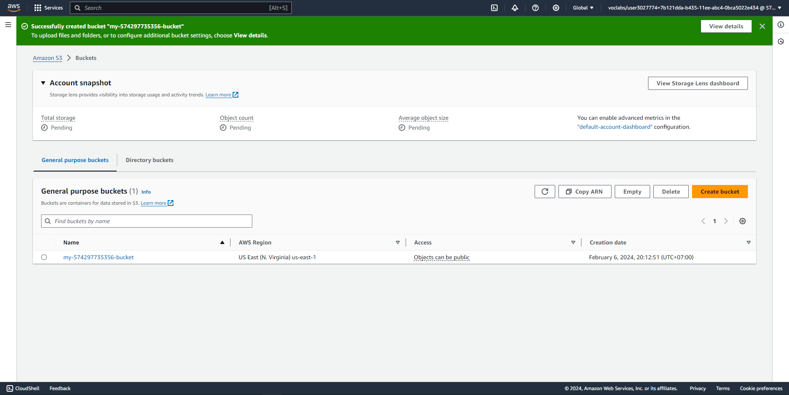
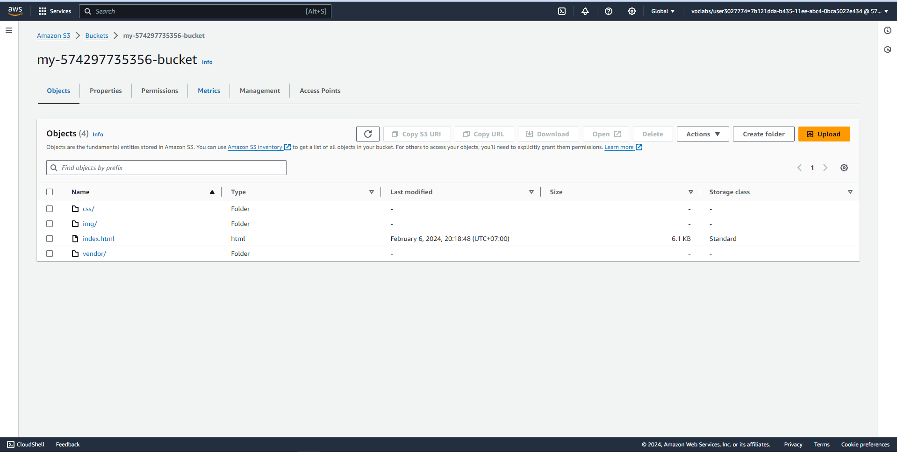
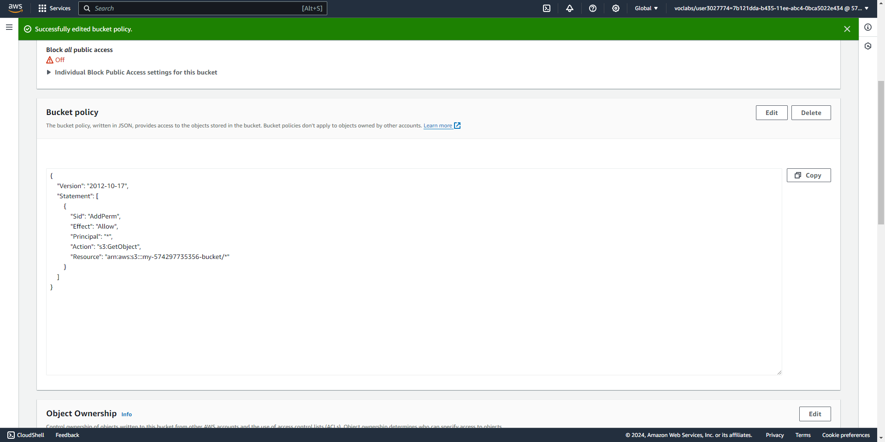
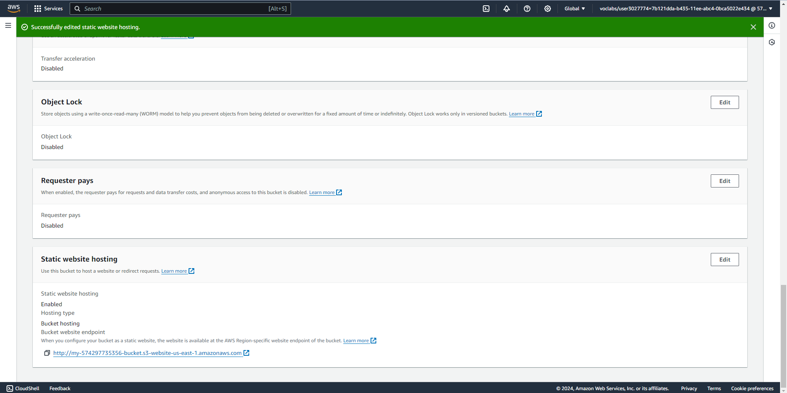
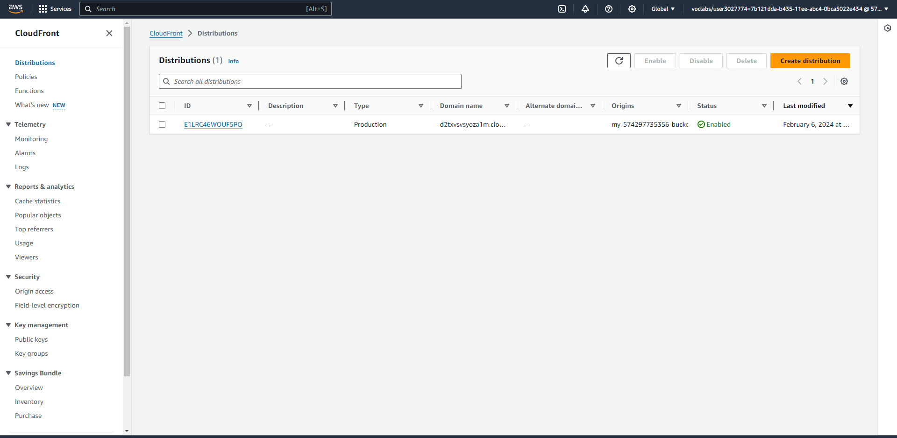

# Deploy Static Website To AWS
> Project 1 in Cloud Developer Udacity

## Services
  - S3.
  - IAM.
  - Cloudfront.

## Description
I have performed these following steps:
  1. Create a public S3 bucket and upload the website files to the bucket.
  2. Secure the bucket using IAM policies.
  3. Configure the bucket to support static website hosting.
  4. Configure CloudFront to retrieve and distribute website files.
  5. Access the website in a browser using the unique CloudFront endpoint.
  
Also, I have made some changes to the original source code:
  - Customize the title of the website.
  - Change the background image.

## Website URL
You can access the website via these urls:
- CloudFront domain name URL: https://d2txvsvsyoza1m.cloudfront.net
- website-endpoint URL: http://my-574297735356-bucket.s3-website-us-east-1.amazonaws.com/

## Screenshot of each step
1. Create a public S3 bucket and upload the website files to the bucket.

2. Secure the bucket using IAM policies.

3. Configure the bucket to support static website hosting.

4. Configure CloudFront to retrieve and distribute website files.

5. Access the website in a browser using the unique CloudFront endpoint.

